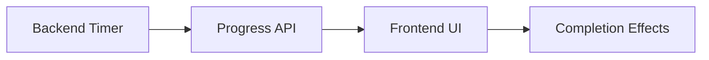

# Timed Rituals Feature Documentation

## Overview
Immersive timed experiences with visual progress tracking

## Features
- Configurable duration (seconds)
- Progress bar visualization
- Digital countdown timer
- Celebratory completion effects

## Usage
```python
# Create a 2-minute ritual
example_ritual = create_timed_ritual(
    name="Morning Reflection",
    description="Start your day with intention",
    duration=120,
    steps=[...],
    effects={...}
)
```

## Customization
- Modify `static/css/style.css` for visual styles
- Adjust animation parameters in `ritual_feedback.js`

## Architecture

